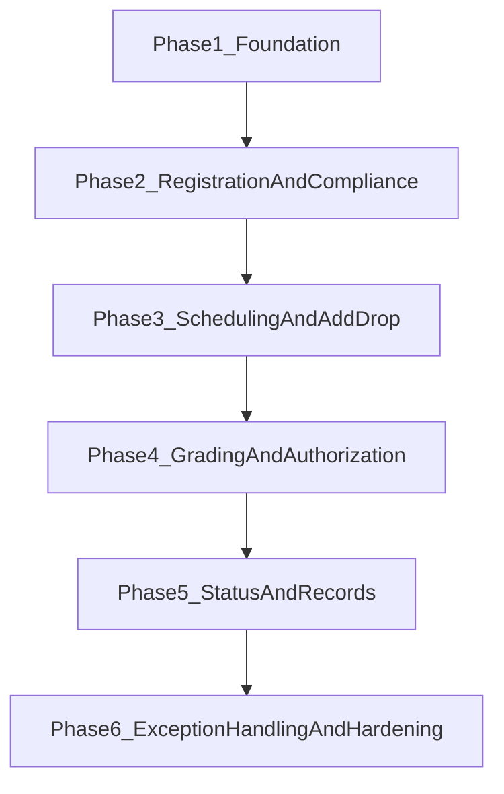

# Course Management Feature-Level Task Breakdown

## Objective

Implement the `Course Management` domain end-to-end in the backend, using the same module pattern already used by undergraduate admission (`models -> schemas -> repository -> service -> router`) and preserving human-in-the-loop checkpoints.

## Source-of-truth Alignment

This plan is bound to two upstream specifications and inherits their numbering exactly:

- **SRS** Course-FR-01 to Course-FR-13 (§3.2.3) and UC-CM-01 to UC-CM-13 (§3.3); inverse requirements in §3.5; logical DB requirements in §3.7.
- **SDS** Course Management Module — class diagram Figure 5 (§3.1.3), sequence diagrams Figures 25–37 (§3.2.3), state diagram Figure 39 (§3.3), detailed design Tables 55–84 (§5.3).

Class names, attribute names, operation signatures, and enum values used by the implementation **must match the SDS verbatim** so the running system is traceable to the design document. See [course-management-implementation-checklist.md](course-management-implementation-checklist.md) for the per-table mapping.

## Architecture Caveat

The SRS §3.4.5 and SDS §1.2 describe a microservice-oriented system with gRPC for inter-service communication. The current codebase is a **modular monolith** with REST and an in-process event bus (see project [README.md](README.md)). This is a deliberate phase-1 simplification, not a violation: each module already isolates its own models/services/router stack, so individual modules — including Course Management — can be lifted into their own microservice later without rewriting their internals. The plan below builds inside the monolith and treats the future split as a non-functional refactor.

## Current Baseline

- Placeholder module exists:
  - [/home/yohannes/Final_year_project/Agentic-Registrar-Backend/app/modules/course/router.py](/home/yohannes/Final_year_project/Agentic-Registrar-Backend/app/modules/course/router.py)
  - [/home/yohannes/Final_year_project/Agentic-Registrar-Backend/app/modules/course/service.py](/home/yohannes/Final_year_project/Agentic-Registrar-Backend/app/modules/course/service.py)
- Wired modules to mirror for implementation style:
  - [/home/yohannes/Final_year_project/Agentic-Registrar-Backend/app/modules/undergraduate](/home/yohannes/Final_year_project/Agentic-Registrar-Backend/app/modules/undergraduate)
  - [/home/yohannes/Final_year_project/Agentic-Registrar-Backend/app/modules/testing_center](/home/yohannes/Final_year_project/Agentic-Registrar-Backend/app/modules/testing_center)

## Feature-Level Work Packages

### 1) Core Academic Catalog & Structure

Implement foundational entities and read APIs.

- Features
  - Course catalog (code, title, credit, semester, department)
  - Course offering per term (capacity, section count)
  - Section entity (section code, slot, room, instructor)
  - Prerequisite mapping (course -> required courses)
- Deliverables
  - New/updated models in [/home/yohannes/Final_year_project/Agentic-Registrar-Backend/app/modules/course/models.py](/home/yohannes/Final_year_project/Agentic-Registrar-Backend/app/modules/course/models.py)
  - Schemas and list/get endpoints in [/home/yohannes/Final_year_project/Agentic-Registrar-Backend/app/modules/course/schemas.py](/home/yohannes/Final_year_project/Agentic-Registrar-Backend/app/modules/course/schemas.py) and [/home/yohannes/Final_year_project/Agentic-Registrar-Backend/app/modules/course/router.py](/home/yohannes/Final_year_project/Agentic-Registrar-Backend/app/modules/course/router.py)
  - Alembic migration(s) under [/home/yohannes/Final_year_project/Agentic-Registrar-Backend/alembic/versions](/home/yohannes/Final_year_project/Agentic-Registrar-Backend/alembic/versions)

### 2) Registration Workflow (SRS Course-FR-01, FR-02)

Enable student course registration with payment/form gate.

- Features
  - Registration window control (open/closed)
  - Submit registration requests for offered courses
  - Government/self-sponsored payment/form validation gate via `PayMock.getPaymentStatus(studentID, courseID)` (SDS Table 87)
  - Registration finalization state
- Deliverables
  - Registration models + a `RegistrationStatus` enum whose values mirror SDS Figure 39 exactly: `REGISTRATION_OPEN, ADVISOR_REVIEW, CHECKING_PREREQUISITES, CHECKING_PAYMENT, PAYMENT_HOLD, VALIDATION_SUCCESS, REGISTERED, ADD_DROP_WINDOW, CANCELLED`
  - Service methods in [/home/yohannes/Final_year_project/Agentic-Registrar-Backend/app/modules/course/service.py](/home/yohannes/Final_year_project/Agentic-Registrar-Backend/app/modules/course/service.py)
  - Student-facing endpoints in course router

### 3) Curriculum Compliance Agent (SRS Course-FR-03)

Automate prerequisite and load checks before confirmation.

- Features
  - Prerequisite validation against completed history (`verifyPrerequisites(studentID, courseID): Boolean`, SDS Table 66)
  - Credit-load rules enforcing **max 22 ECTS** by academic status, via `validateRegistration(app: Registration): Boolean`
  - Payment cross-check via `checkPaymentStatus(studentID): Boolean`
  - Blocking/flagging behavior with explainable reasons
  - Prerequisite-bypass override gated to `OfficerRole.DEPARTMENT_HEAD` per SRS §3.5 inverse requirement (Course Registration Agent shall not permit registration when prerequisites are unmet unless a manual override is granted by the Department Head)
- Deliverables
  - New agent implementation in `app/modules/course/agents/curriculum_compliance_agent.py`
  - Service orchestration call and persisted validation traces
  - Audit trail entries via existing logging/audit utilities

### 4) Section Allocation & Scheduling (SRS Course-FR-04)

Assign students to sections and generate conflict-safe schedules.

- Features
  - Section allocation by capacity (`allocateSections(studentList): void`)
  - Timetable generation by room/instructor availability (`generateTimetable(departmentID): Schedule`)
  - Time slots restricted to standard university lecture hours **08:30 – 17:30** (SDS Table 83)
  - Room search via `getAvailableRooms(capacityReq, time): List<Room>`
  - Instructor assignment via `assignInstructor(courseID, instructorID): void`
  - Conflict detection and fallback strategy (`resolveRoomConflict(courseID, slot): Boolean`)
- Deliverables
  - Scheduling logic in service + repository methods
  - Dedicated agent `academic_scheduling_agent.py` matching SDS Table 82 class spec
  - Endpoints for officer to trigger/regenerate schedules

### 5) Add/Drop Management (SRS Course-FR-05)

Handle post-registration course changes.

- Features
  - Add/drop request creation and workflow status (`processAddDrop(request: AdjustmentRequest)`, SDS Table 81)
  - Deadline enforcement (`validateAdjustmentWindow(): Boolean` against `addDropDeadline: Date` synced to the official AAU academic calendar)
  - Load revalidation enforcing **min 12 ECTS** floor (SDS Table 80 invariant)
  - Section capacity updates via `updateSectionCapacity(courseID, action: AddDropAction)` where `AddDropAction ∈ {ADD, DROP}`
  - Payment cross-check on every add (`crossCheckPayment(studentID): Boolean`)
  - Confirmation hook via `notifyAdjustmentSuccess(studentID): void`
- Deliverables
  - Adjustment models and endpoints
  - Policy-driven checks in service and repository

### 6) Academic Advisory Agent (SRS Course-FR-06)

Provide recommendation layer for risky or overloaded selections.

- Features
  - History-aware course guidance (`evaluateStudyPlan(studentID)` and `provideAcademicGuidance(studentID): Advice`, SDS Table 69)
  - Risk scoring (`flagRiskLevel(studentID): RiskStatus` returning LOW/MEDIUM/HIGH)
  - Course-load approval (`approveCourseLoad(studentID): Boolean`) that escalates HIGH-risk loads to the `CourseManagementOfficer`
  - Suggestion engine invariant: prioritise mandatory core courses over electives (SDS Table 68)
  - Recommendation outputs tied to requests
- Deliverables
  - New agent `academic_advisory_agent.py`
  - API endpoint for "recommend courses / evaluate plan"

### 7) Grade Entry + Monitoring (SRS Course-FR-07, FR-08)

Support instructor submission and anomaly checks.

- Features
  - Instructor grade entry for assigned sections via `Instructor.submitGrades(courseID, grades)` (SDS Table 60)
  - Assessment-breakdown editor (`Instructor.updateAssessmentBreakdown(courseID, weight): Boolean`) that rejects any weight map whose values don't sum to **exactly 100**
  - Roster view (`Instructor.viewCourseRoster(courseID): List<Student>`)
  - Deadline compliance checks (`AssessmentValidationAgent.validateDeadlineCompliance(courseID): Boolean`)
  - Outlier/anomaly detection (`detectGradeAnomalies(grades): List<Flag>`) using `anomalyThreshold = 2.5` standard deviations by default (SDS Table 71)
  - Class-average baseline (`calculateClassAverage(courseID): Double`)
  - Periodic monitor (`monitorGradeEntry(courseID)`) gated to courses currently in the "Grading Phase" academic-calendar state
- Deliverables
  - Grade models + schemas + endpoints
  - Monitoring/validation agent `assessment_validation_agent.py` matching SDS Table 70 class spec
  - Officer review queue for flagged grade submissions

### 8) Human Grade Authorization (SRS Course-FR-09)

Add mandatory human approval gate for final grade publication.

- Features
  - Officer approve/reject workflow via `CourseManagementOfficer.authorizeGrades(courseID): void` (SDS Table 63), preconditioned on the `AssessmentValidationAgent` having completed anomaly detection
  - Locking once grades are official (post-condition: grades marked "Official" and visible to students)
  - Traceability of approver identity and timestamp
- Deliverables
  - Authorization endpoints + audit logging
  - Role-guarded dependencies via existing auth pattern; both `OfficerRole.REGISTRAR_OFFICER` and `OfficerRole.DEPARTMENT_HEAD` may authorize, gated by `authorizationLevel ∈ [1,5]`

### 9) Academic Status Assignment + Final Authorization (SRS Course-FR-10, FR-11)

Compute and authorize promotion/warning/dismissal/incomplete outcomes.

- Features
  - GPA calculator (`calculateGPA(studentID, semester): Double`) credit-weighted (SDS Table 75)
  - CGPA calculator (`calculateCGPA(studentID): Double`) aggregating every completed term
  - Status rules engine driven by `statusRules: Map<Status, Rule>` with the SDS thresholds **Warning at CGPA < 2.0** and **Distinction at CGPA > 3.5** (Table 74)
  - Status assignment (`assignStatus(studentID): AcademicStatus`) returning `{PROMOTED, WARNING, DISTINCTION, DISMISSED, INCOMPLETE}`
  - Edge-case handler (`handleEdgeCase(studentID)`) that holds the calculation when "I" or "NG" marks are present and alerts the officer
  - Notification hook (`notifyStatusChange(studentID, status)`) firing email/SMS after authorization
  - Manual override checkpoint and reason capture
- Deliverables
  - Agent `academic_standing_agent.py` matching SDS Table 73 class spec
  - Status entity/history records
  - Officer final authorization APIs (`CourseManagementOfficer.authorizeFinalStatus(studentID): void`, SDS Table 63)

### 10) Academic Record Generation (SRS Course-FR-12)

Generate semester documents and archives.

- Features
  - Grade report generation via `AcademicRecordsAgent.generateGradeReport(studentID): PDF` (SDS Table 78)
  - Filing slip generation via `generateFilingSlip(studentID, semester): PDF`
  - Digitally signed PDFs using `encryptionKey` (SDS Table 77)
  - Tamper verification via `verifyDocumentIntegrity(documentID): Boolean`
  - Archival run (`archiveSemesterData()`) into a write-once-read-many (WORM) volume — only after every departmental grade is officer-authorised
  - Legacy SIS sync (`syncWithLegacySIS(studentID): Boolean`) pushing agent-calculated totals to the university's centralised legacy system
- Deliverables
  - Record generation service (`pdf/report` integration hook)
  - Data model for generated records + metadata
  - `archiveStoragePath` configured to a WORM volume; `reportTemplate` follows official AAU Registrar branding (SDS Table 77)

### 11) Manual Exception Handling (SRS Course-FR-13)

Centralized workflow for flagged edge cases.

- Features
  - Unified exception queue
  - Resolve/override endpoints with mandatory reason
  - Re-trigger agent workflows after resolution
- Deliverables
  - Exception model and workflow APIs
  - Integration with existing system audit log

### 12) API Integration & App Wiring

Enable module in runtime and docs.

- Tasks
  - Include `course_router` in [/home/yohannes/Final_year_project/Agentic-Registrar-Backend/app/main.py](/home/yohannes/Final_year_project/Agentic-Registrar-Backend/app/main.py)
  - Register new course-related models in model registry imports
  - Ensure route prefixes/tags align with `/api/v1`
  - Wire pgvector extension and a `policy_documents` table to support the SRS §3.7 "Vectorized Policy Knowledge Base" — the `CourseBaseAgent` exposes a policy-grounding hook that rule-based phase-1 agents leave as a no-op and LangGraph-upgraded phase-2 agents will populate via Retrieval-Augmented Generation

### 13) Data, Migration, and Seed Support

Make feature runnable and testable.

- Tasks
  - Add migrations per feature increment
  - Extend seed scripts for courses/sections/instructors/students
  - Add synthetic test datasets for schedule and grading edge cases

### 14) Test Strategy by Feature

Implement tests in lockstep with features.

- Unit tests
  - Service rules (prereq, load, deadlines, status thresholds)
  - Agent node behavior and deterministic branches
- Integration tests
  - Registration -> add/drop -> grading -> authorization -> status -> report lifecycle
  - RBAC access boundaries per role
- Location
  - [/home/yohannes/Final_year_project/Agentic-Registrar-Backend/tests/test_course](/home/yohannes/Final_year_project/Agentic-Registrar-Backend/tests/test_course)

## Recommended Delivery Phases

- Phase 1: Feature 1 + migrations + seed base
- Phase 2: Features 2-3
- Phase 3: Features 4-6
- Phase 4: Features 7-8
- Phase 5: Features 9-10
- Phase 6: Features 11-14 + production hardening

## Definition of Done (Module Level)

- Course router is active and documented under `/api/v1`.
- All SRS Course-FR-01 to Course-FR-13 have at least one implemented endpoint/workflow.
- Human-in-the-loop checkpoints exist for grade and status finalization.
- Migrations and seed flows run cleanly on fresh database.
- `tests/test_course` covers critical lifecycle and RBAC rules.
