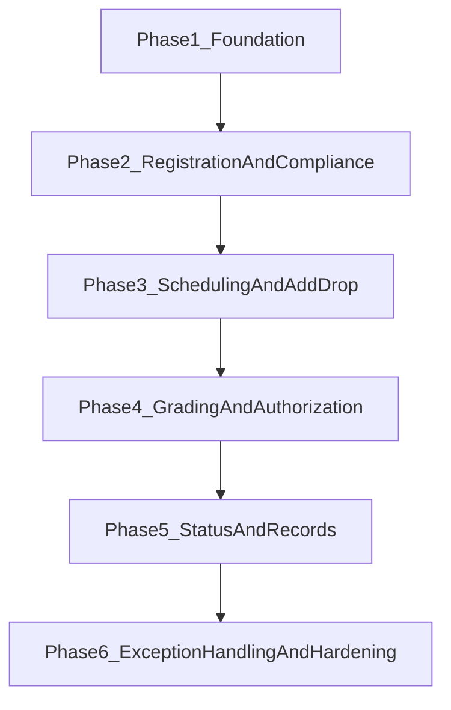

# Course Management Feature-Level Task Breakdown

## Objective

Implement the `Course Management` domain end-to-end in the backend, using the same module pattern already used by undergraduate admission (`models -> schemas -> repository -> service -> router`) and preserving human-in-the-loop checkpoints.

## Current Baseline

- Placeholder module exists:
  - [/home/yohannes/Final_year_project/Agentic-Registrar-Backend/app/modules/course/router.py](/home/yohannes/Final_year_project/Agentic-Registrar-Backend/app/modules/course/router.py)
  - [/home/yohannes/Final_year_project/Agentic-Registrar-Backend/app/modules/course/service.py](/home/yohannes/Final_year_project/Agentic-Registrar-Backend/app/modules/course/service.py)
- Wired modules to mirror for implementation style:
  - [/home/yohannes/Final_year_project/Agentic-Registrar-Backend/app/modules/undergraduate](/home/yohannes/Final_year_project/Agentic-Registrar-Backend/app/modules/undergraduate)
  - [/home/yohannes/Final_year_project/Agentic-Registrar-Backend/app/modules/testing_center](/home/yohannes/Final_year_project/Agentic-Registrar-Backend/app/modules/testing_center)

## Feature-Level Work Packages

### 1) Core Academic Catalog & Structure

Implement foundational entities and read APIs.

- Features
  - Course catalog (code, title, credit, semester, department)
  - Course offering per term (capacity, section count)
  - Section entity (section code, slot, room, instructor)
  - Prerequisite mapping (course -> required courses)
- Deliverables
  - New/updated models in [/home/yohannes/Final_year_project/Agentic-Registrar-Backend/app/modules/course/models.py](/home/yohannes/Final_year_project/Agentic-Registrar-Backend/app/modules/course/models.py)
  - Schemas and list/get endpoints in [/home/yohannes/Final_year_project/Agentic-Registrar-Backend/app/modules/course/schemas.py](/home/yohannes/Final_year_project/Agentic-Registrar-Backend/app/modules/course/schemas.py) and [/home/yohannes/Final_year_project/Agentic-Registrar-Backend/app/modules/course/router.py](/home/yohannes/Final_year_project/Agentic-Registrar-Backend/app/modules/course/router.py)
  - Alembic migration(s) under [/home/yohannes/Final_year_project/Agentic-Registrar-Backend/alembic/versions](/home/yohannes/Final_year_project/Agentic-Registrar-Backend/alembic/versions)

### 2) Registration Workflow (SRS Course-FR-01, FR-02)

Enable student course registration with payment/form gate.

- Features
  - Registration window control (open/closed)
  - Submit registration requests for offered courses
  - Government/self-sponsored payment/form validation gate
  - Registration finalization state
- Deliverables
  - Registration models + state enum additions in shared enums
  - Service methods in [/home/yohannes/Final_year_project/Agentic-Registrar-Backend/app/modules/course/service.py](/home/yohannes/Final_year_project/Agentic-Registrar-Backend/app/modules/course/service.py)
  - Student-facing endpoints in course router

### 3) Curriculum Compliance Agent (SRS Course-FR-03)

Automate prerequisite and load checks before confirmation.

- Features
  - Prerequisite validation against completed history
  - Credit load min/max rules by academic status
  - Blocking/flagging behavior with explainable reasons
- Deliverables
  - New agent implementation in `app/modules/course/agents/curriculum_compliance_agent.py`
  - Service orchestration call and persisted validation traces
  - Audit trail entries via existing logging/audit utilities

### 4) Section Allocation & Scheduling (SRS Course-FR-04)

Assign students to sections and generate conflict-safe schedules.

- Features
  - Section allocation by capacity
  - Timetable generation by room/instructor availability
  - Conflict detection and fallback strategy
- Deliverables
  - Scheduling logic in service + repository methods
  - Optional dedicated agent `academic_scheduling_agent.py`
  - Endpoints for officer to trigger/regenerate schedules

### 5) Add/Drop Management (SRS Course-FR-05)

Handle post-registration course changes.

- Features
  - Add/drop request creation and workflow status
  - Deadline enforcement and load revalidation
  - Section capacity updates after add/drop
- Deliverables
  - Adjustment models and endpoints
  - Policy-driven checks in service and repository

### 6) Academic Advisory Agent (SRS Course-FR-06)

Provide recommendation layer for risky or overloaded selections.

- Features
  - History-aware course guidance
  - Risk scoring (low/medium/high)
  - Recommendation outputs tied to requests
- Deliverables
  - New agent `academic_advisory_agent.py`
  - API endpoint for “recommend courses / evaluate plan”

### 7) Grade Entry + Monitoring (SRS Course-FR-07, FR-08)

Support instructor submission and anomaly checks.

- Features
  - Instructor grade entry for assigned sections
  - Deadline compliance checks
  - Outlier/anomaly detection and flag generation
- Deliverables
  - Grade models + schemas + endpoints
  - Monitoring/validation agent `assessment_validation_agent.py`
  - Officer review queue for flagged grade submissions

### 8) Human Grade Authorization (SRS Course-FR-09)

Add mandatory human approval gate for final grade publication.

- Features
  - Officer approve/reject workflow
  - Locking once grades are official
  - Traceability of approver identity and timestamp
- Deliverables
  - Authorization endpoints + audit logging
  - Role-guarded dependencies via existing auth pattern

### 9) Academic Status Assignment + Final Authorization (SRS Course-FR-10, FR-11)

Compute and authorize promotion/warning/dismissal/incomplete outcomes.

- Features
  - GPA/CGPA calculators
  - Status rules engine (policy thresholds)
  - Manual override checkpoint and reason capture
- Deliverables
  - Agent `academic_standing_agent.py`
  - Status entity/history records
  - Officer final authorization APIs

### 10) Academic Record Generation (SRS Course-FR-12)

Generate semester documents and archives.

- Features
  - Grade report generation
  - Filing slip generation
  - Archival and retrieval endpoints
- Deliverables
  - Record generation service (`pdf/report` integration hook)
  - Data model for generated records + metadata

### 11) Manual Exception Handling (SRS Course-FR-13)

Centralized workflow for flagged edge cases.

- Features
  - Unified exception queue
  - Resolve/override endpoints with mandatory reason
  - Re-trigger agent workflows after resolution
- Deliverables
  - Exception model and workflow APIs
  - Integration with existing system audit log

### 12) API Integration & App Wiring

Enable module in runtime and docs.

- Tasks
  - Include `course_router` in [/home/yohannes/Final_year_project/Agentic-Registrar-Backend/app/main.py](/home/yohannes/Final_year_project/Agentic-Registrar-Backend/app/main.py)
  - Register new course-related models in model registry imports
  - Ensure route prefixes/tags align with `/api/v1`

### 13) Data, Migration, and Seed Support

Make feature runnable and testable.

- Tasks
  - Add migrations per feature increment
  - Extend seed scripts for courses/sections/instructors/students
  - Add synthetic test datasets for schedule and grading edge cases

### 14) Test Strategy by Feature

Implement tests in lockstep with features.

- Unit tests
  - Service rules (prereq, load, deadlines, status thresholds)
  - Agent node behavior and deterministic branches
- Integration tests
  - Registration -> add/drop -> grading -> authorization -> status -> report lifecycle
  - RBAC access boundaries per role
- Location
  - [/home/yohannes/Final_year_project/Agentic-Registrar-Backend/tests/test_course](/home/yohannes/Final_year_project/Agentic-Registrar-Backend/tests/test_course)

## Recommended Delivery Phases

- Phase 1: Feature 1 + migrations + seed base
- Phase 2: Features 2-3
- Phase 3: Features 4-6
- Phase 4: Features 7-8
- Phase 5: Features 9-10
- Phase 6: Features 11-14 + production hardening

## Definition of Done (Module Level)

- Course router is active and documented under `/api/v1`.
- All SRS Course-FR-01 to Course-FR-13 have at least one implemented endpoint/workflow.
- Human-in-the-loop checkpoints exist for grade and status finalization.
- Migrations and seed flows run cleanly on fresh database.
- `tests/test_course` covers critical lifecycle and RBAC rules.
