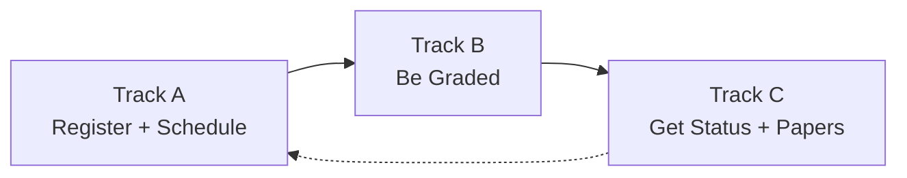
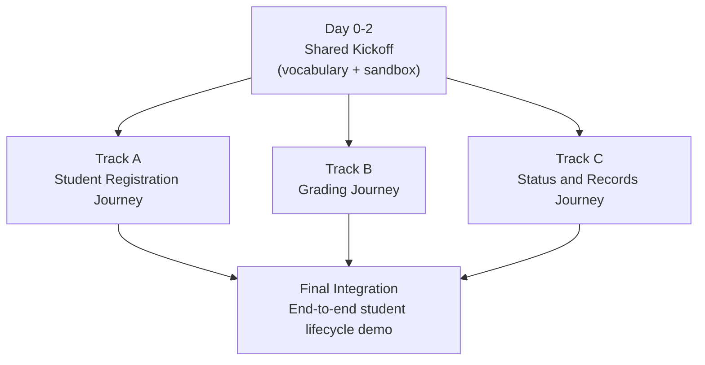

# Course Management Module — Use-Case Oriented Three-Way Split

This document re-expresses the three-way division of work for the Course Management module in terms of **what real users (students, instructors, officers, agents) can do** at each stage, rather than in technical terms. It is a companion to [cource-management-plan.md](cource-management-plan.md).

## Guiding Idea

The module is split so that three people own three complete **user journeys**:

- Track A owns everything a student does to **get into their classes**.
- Track B owns everything an instructor does to **grade those classes**.
- Track C owns everything the registrar does to **decide what the grades mean** and to **issue official paperwork**.

Before splitting, the team spends two days agreeing on shared vocabulary (what a course, section, term, and agent look like) so the three journeys can be built in parallel without any one person waiting on another.

## Phase 0 — Shared Kickoff (2 days, everyone together)

Before the three tracks begin, the team jointly agrees on:

- The common vocabulary used across the module (Course, Section, Term, Student, Instructor, Officer, Agent).
- The ground rules every agent follows (what it means to be idle, busy, waiting for a human, or flagging an exception).
- A shared sandbox of fake courses, instructors, and students that every track can reuse in its own tests.

Outcome: after day 2, the three tracks never again need each other's code to make progress.

---

## Track A — "I Want to Take My Classes This Semester" (Person 1)

This track covers the entire pre-semester journey of a student. Covers SRS Course-FR-01 through FR-06.

### Primary Actors

- **Student** — picks courses, pays fees, changes their mind.
- **Course Management Officer** (`OfficerRole.REGISTRAR_OFFICER`, SDS Table 62) — opens/closes the registration window, triggers schedule generation, approves HIGH-risk advisory verdicts.
- **Department Head** (`OfficerRole.DEPARTMENT_HEAD`, SDS Table 62) — distinct human role required for **prerequisite override**, per SRS §3.5 inverse requirement: "The Course Registration Agent shall not permit course registration when prerequisite requirements are unmet unless a manual override is granted by the Department Head."
- **Instructor** — assigned to sections by the scheduling agent.
- **Autonomous Agents** — Curriculum Compliance, Academic Scheduling, Enrollment Adjustment, Academic Advisory.

### Use Cases Owned by This Track

1. **A student opens the registration portal and sees the courses available to them this semester.** The system only shows courses offered in the current term and aligned with their curriculum.
2. **A student pays their fees (cost-sharing form for government students, per-credit payment for self-sponsored).** Registration cannot be finalised until payment is settled.
3. **A student submits a registration.** The Curriculum Compliance Agent silently checks:
   - Has the student passed every prerequisite? (`verifyPrerequisites`)
   - Does the total credit load respect the policy ceiling of **22 ECTS** (SDS Table 65) and floor of **12 ECTS** (SDS Table 80)?
   - Is the payment confirmed? (`checkPaymentStatus` → `PayMock.getPaymentStatus`)

   If any check fails, the student sees an explanation and can adjust their choice. If all pass, the registration moves forward. The student's lifecycle states match SDS Figure 39: `Registration_Open → Advisor_Review → Validation_Pending → Registered → Add_Drop_Window`.

   **Prerequisite-override exception path (SRS §3.5):** if the agent blocks a registration purely on prerequisites and the student appeals, only a **Department Head** (not a Registrar Officer) can grant the override. The override is logged with a written justification per `CourseManagementOfficer.resolveManualException(flag)`.
4. **An officer opens or closes the registration window for a term.** Students cannot register when the window is closed.
5. **An officer clicks "Generate Schedule" for a department.** The Academic Scheduling Agent:
   - Groups registered students into sections that respect room and instructor capacity.
   - Produces a weekly timetable that avoids room and instructor clashes.
   - Shows the officer any unresolvable conflict for human review.
6. **A student views their personal timetable** once the schedule has been generated.
7. **A student files an add or drop request** after the semester has started. The Enrollment Adjustment Agent checks the deadline, the updated credit load, the new payment (if any), and the section capacity.
8. **A student asks the Academic Advisory Agent for guidance** before finalising choices. The agent:
   - Looks at the student's past grades.
   - Labels the proposed load as Low, Medium, or High risk.
   - Suggests safer alternatives when the load is High risk.
9. **An officer reviews any add/drop or risky plan that the agents flagged** and either approves or overrides with a written reason.

### Definition of Done for Track A

- A student can go from "I want to register" to "I have a confirmed timetable" entirely inside the system.
- Every agent decision in the path above is recorded in the audit log.
- Every HITL (human-in-the-loop) checkpoint is reachable from the officer portal.
- The track ships its own seed data so the journey can be demoed without Tracks B or C being merged.

---

## Track B — "I Want to Grade My Students" (Person 2)

This track covers the entire grading journey from the moment teaching ends until grades are official. Covers SRS Course-FR-07, FR-08, FR-09.

### Primary Actors

- **Instructor** — enters grades and fixes anything the agent flags.
- **Course Management Officer** — final human authority on grades.
- **Autonomous Agents** — Assessment Validation, Grade Monitoring, Grade Authorization Facilitator.

### Use Cases Owned by This Track

1. **An instructor declares the assessment breakdown for a section** — for example, 30% midterm, 30% assignments, 40% final. The system only accepts a breakdown that sums to 100%.
2. **An instructor enters grades for every student in a section** and submits the batch.
3. **The Assessment Validation Agent quietly checks the submitted batch for:**
   - Grades outside the allowed range.
   - Statistically unusual distributions (e.g., almost everyone at an extreme).
   - Missing entries.

   If anything looks off, the agent raises a flag with a plain-language reason and the instructor is asked to confirm or fix it.
4. **The Grade Monitoring Agent watches the calendar** during the grading window. If a section has not submitted by a set number of days before the deadline, the instructor receives an automated reminder. If the deadline passes, the officer receives an alert.
5. **The Grade Authorization Facilitator Agent prepares a review packet** for the officer: the submitted grades, the class average, the flags raised, and the instructor's replies. The officer does not have to hunt for this context.
6. **The officer opens the review packet and either:**
   - Authorises the grades (they become official and visible to students), or
   - Sends them back to the instructor with a reason.
7. **An instructor can view the current status of every one of their submissions** (Draft, Submitted, Flagged, Authorized, Rejected).
8. **An officer can view the queue of flagged grade submissions** across all departments and process them in priority order.

### Definition of Done for Track B

- An instructor can go from "Teaching is over" to "Grades are officially authorised" entirely inside the system.
- Every grade change is logged with who did it and when.
- No grade becomes official without an explicit officer click.
- The track ships its own fake section + student seed data so the grading journey is demonstrable without Track A being merged.

---

## Track C — "I Want to Know Where I Stand and Get My Papers" (Person 3)

This track covers everything that happens after grades are authorised: turning grades into an academic status and into official documents, plus a single place for handling edge cases. Covers SRS Course-FR-10, FR-11, FR-12, FR-13.

### Primary Actors

- **Student** — receives their status notification and downloads documents.
- **Course Management Officer** — authorises final statuses and resolves exceptions.
- **Autonomous Agents** — Academic Standing, Academic Records, Exception Resolution.

### Use Cases Owned by This Track

1. **An officer clicks "Compute Standing" at the end of a term.** For each student, the Academic Standing Agent:
   - Calculates the semester GPA and the cumulative CGPA.
   - Applies the university's thresholds to propose a status: Promoted, Warning, Dismissed, Distinction, or Incomplete.
   - Treats edge cases (e.g., "I" or "NG" marks) by routing them to the exception queue instead of guessing.
2. **The officer reviews the proposed status for each student** and authorises or overrides it. Until this authorisation happens, the status is not official.
3. **Once authorised, the student receives a notification** explaining their new status in clear language.
4. **A student asks for a grade report for a specific semester.** The Academic Records Agent generates an official, digitally signed PDF.
5. **A student asks for a filing slip for the upcoming semester.** The Academic Records Agent produces the required registration-support PDF.
6. **At the end of every term, the Academic Records Agent archives the semester's data** into the permanent record store so that historical transcripts remain reproducible and tamper-evident.
7. **Any anomaly raised anywhere in the module (wrong grade pattern, blocked registration, incomplete status, medical exception) appears in one unified exception queue.** The Exception Resolution Agent normalises them so the officer sees the same shape regardless of source.
8. **The officer opens an exception, records a written justification, and resolves it.** The originating workflow is automatically re-triggered so the student is not stuck.
9. **An auditor can verify the integrity of any issued PDF** by supplying its ID; the system confirms whether the document was ever tampered with.

### Definition of Done for Track C

- A student can go from "The term just ended" to "I have my official status and my signed grade report" entirely inside the system.
- Every status change is captured in an immutable history.
- Every exception is resolved with a stored justification — no silent overrides.
- The track ships its own fake authorised-grade seed data so the journey is demonstrable without Track B being merged.

---

## How the Three Journeys Connect

Although the three people build in parallel, the journeys stack naturally end-to-end for a real student:

The dotted line back to Track A represents the next term: the student, now with a new status, starts the registration journey again.

## Parallel Delivery Timeline

## Agents Touched by Each Track

- **Track A (4 agents):** Curriculum Compliance, Academic Scheduling, Enrollment Adjustment, Academic Advisory.
- **Track B (3 agents):** Assessment Validation, Grade Monitoring, Grade Authorization Facilitator.
- **Track C (3 agents):** Academic Standing, Academic Records, Exception Resolution.

Total: **10 agents** across the module, each beginning as a rule-based skeleton that can later be upgraded to a full LangGraph stateful workflow with RAG grounding over the **pgvector**-backed AAU policy knowledge base mandated by SRS §3.7.

## Human-in-the-Loop Checkpoints (by Track)

- **Track A:** Course Management Officer approves add/drop exceptions and HIGH-risk course loads; officer opens/closes the registration window. **Department Head** is the *only* role authorized to override a prerequisite block (SRS §3.5).
- **Track B:** Course Management Officer authorises every final grade batch before it becomes visible to students.
- **Track C:** Course Management Officer authorises every final academic status; officer resolves every flagged exception with a written reason via `resolveManualException(flag)`.

No critical decision (admission, dismissal, final grade, final status) is ever executed by an agent alone — this matches SRS Section 2.4 ("Human Authority Constraint").

## Traceability to SRS Functional Requirements

- Track A: Course-FR-01, FR-02, FR-03, FR-04, FR-05, FR-06.
- Track B: Course-FR-07, FR-08, FR-09.
- Track C: Course-FR-10, FR-11, FR-12, FR-13.

Every SRS Course-FR is covered exactly once by exactly one track, so ownership is unambiguous.
